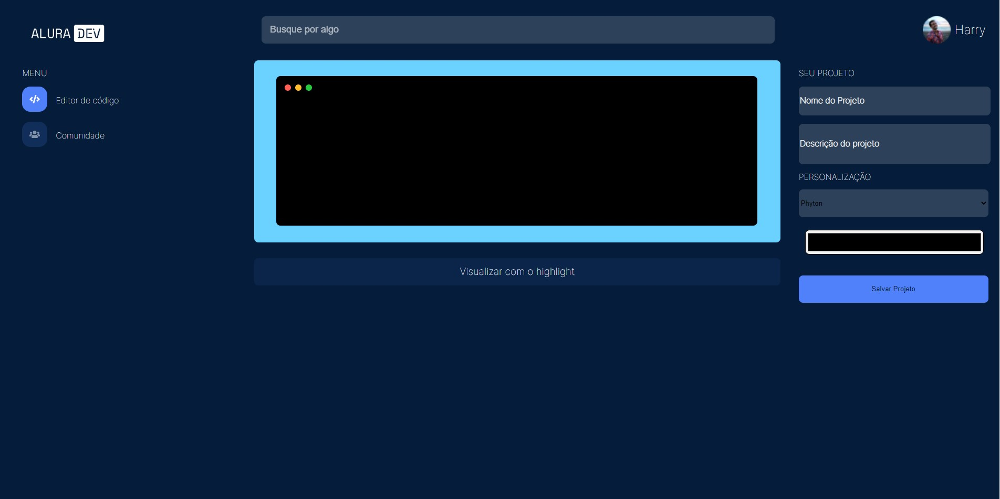

<h1>Front-end Alura Challenge</h1>

  Projeto feito num evento da Alura para iniciantes em front-end. Este foi minha
  primeira página feita.
   
  Infelizmente, não cheguei a terminar o projeto a tempo, então as aulas do
  evento sairam do ar e o projeto ficou pela metade. Mas acho interessante
  mante-lo por aqui porque foi meu primeiro projeto.

<h2>Tecnologias:</h2>
<ul style='font-size:17px'>
  <li>
  HTML
  </li>
  <li>
    CSS
  </li>
</ul>

<h2>Demo 📷</h2>

 
  

<h2>Publicação</h2>

Você pode olhar o resultado da página pelo Vercel neste <a href='https://front-end-alura-challenge.vercel.app/'>link</a>

